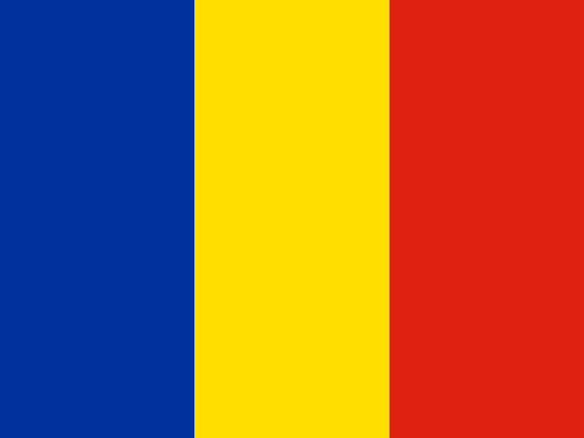

# Radu Nedelcu

Hi! I`m a 20-year-old university student from Romania, passionate about computers and technology.

## Education

I`m currently studying Computer Science at the Univeristy of Bucharest (2021 - 2024). 

# :open_file_folder: Tech Stack

### Front End

<code>    </code>

### Back End
 <code>  </code>

 ### Currently Learning: 
 - Unity
 - OOP in Java
 - Networking Fundamentals

# Skills and Hobbies

- :triangular_ruler: 3D Printing and Modelling : <b> Fusion 360 </b>
- :camera: Photography and photo editing : <b>Adobe Photoshop and Lightroom</b>
- :movie_camera: Video editing : <b>Adobe Premiere Pro and After Effects</b>
- :weight_lifting_man: Weight lifting
- :battery: Computer components and tech
- :headphones: Audiophile 
- :keyboard: Mechanical Keyboards 

### Currently learning: :green_book: Adobe InDesign

# Languages

| Language  | Level |
| --- | --- |
|  Romanian | Native |
|  English | C2 |

